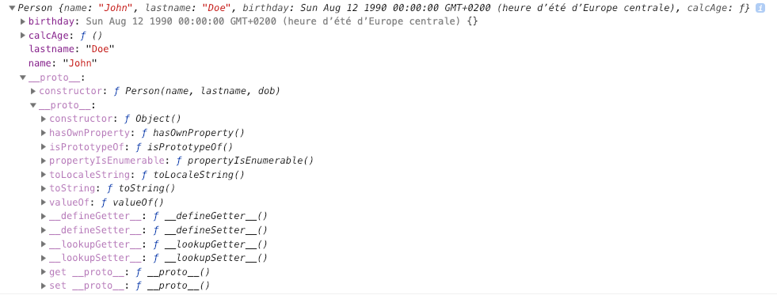

# Modern Javascript

[1. Intro & Getting started]
[2. Javascript Language Fundamentals](#javascript-language-fundamentals)

## Javascript Language Fundamentals


### Var let & const

### Data Types in Javascript

* Primitive data types:
Stores directly in the location the variable accesses
Stored on the stack

- String
- Number
- Boolean
- Null
- Undefined
- Symbols (ES6)

* Reference data types: 
Accessed by reference 
Objects that are stored on the heap
A pointer to a location in memory

- Arrays
- Object literals
- Functions
- Dates
- Anything else

Javascript is a dynamically typed language

Types are associated with values not variables
The same variable can hold multiple types
We do not need to specify types
There are supersets of JS to allow static typing (typescript ie)


### 11. Template Literals

```
const name = 'Ben';
const age = 26;
const job = 'developer';

// Without the template strings (es5)
html = '<ul>' +
        '<li>Name:' + name + '</li>' +
        '<li>Age:' + age + '</li>' +
        '<li>Job' + job + '</li>' +
        '</ul>'

// With
html = `
    <ul>
        <li>Name: ${name}</li>
        <li>Age: ${age}</li>
        <li>Job: ${Job}</li>
        <li>${age > 30 ? 'Over 30' : 'Under 30'</li>
    </ul>
`;
document.body.innerHTML = html;
```


### 13. Object Literals

```
const person = {
    firstName: 'Ben';
}
```

### 17. Function Declaration & Expression

***Function Declaration***
```
function greet(firstName = 'John', lastName = 'Doe'){
    //console.log('hello world');
    return 'Hello ' + firstname + ' ' + lastName;
}

console.log(greet());
```

***Function Expression***
NB: Often the function in a function expression is anonymous
Function expression have benefits for hoisting & closure

```
const square = function(x){
    return x*x;
};
console.log(square(8));
```

They're actually really similar. How you call them is exactly the same. The difference lies in how the browser loads them into the execution context.
- Function declarations load before any code is executed.
- Function expressions load only when the interpreter reaches that line of code.
So if you try to call a function expression before it's loaded, you'll get an error! If you call a function declaration instead, it'll always work, because no code can be called until all declarations are loaded.

Example: Function Expression

```
alert(foo()); // ERROR! foo wasn't loaded yet
var foo = function() { return 5; } 
```

Example: Function Declaration
```
alert(foo()); // Alerts 5. Declarations are loaded before any code can run.
function foo() { return 5; } 
```

***Immidiately Invokable Function Expressions - IIFEs***
NB: They are usefull for some design pattern (ie: modul pattern)
```
(function(){
    console.log('IIFE Ran..');
})();
```

***Property methods***
Functions inside an object
```
const todo = {
    add: function(){
        console.log('Add todo..');
    },
    edit: function(id){
        console.log(`Edit todo ${id}`);
    }
}
todo.add();
todo.edit(15);
```


### 18. General Loop
***For loop***
```js
for (let i=0; i<10; i++){
    if(i === 2){
        console.log('2 is my fav num');
        continue; 
    }

    if(i===5){
        console.log('stop the loop');
        break;
    }

    console.log('Number: ' + i);
}
```

***While loop***
```js
let i = 0;

while(i < 10){
    console.log(i);
    i++;
}
```

***Do while loop***
Will run at least one before looking at the condition
```js

let i = 0;

do{
    console.log('Number '+ i);
    i++;
}
while(i < 10);
```

***Loop through array***

```js
const cars = ['Ford', 'Chevy', 'Honda', 'Ferrari' ];

cars.forEach(function(car, index, array){
    console.log(`${index} : ${car}`);
});
```

***Map loop***

```js
const users = [
    {id: 1, name: 'John'},
    {id: 2, name: 'Ben'},
    {id: 3, name: 'Madison'},
];

const ids = users.map(function(user){
    return user.id;
});

console.log(ids);
```

***For in loop***

```js
const user = {
    firstName: 'John',
    lastName: 'Doe',
    age: 26
}

for(let x in user){
    console.log(`${x} : ${user[x]}`);
}

```

#### Block Scope with let & const

```js
var a = 1;
let b = 2;
const c = 3;

console.log('Global Scope: ', a, b, c);

function test(){
    // Function scope
    var a = 4;
    let b = 5;
    const c = 6;
    console.log('Function Scope: ', a, b, c);
}

//test();

if(true){
    // Block scope
    var a = 4;
    let b = 5;
    const c = 6;
    console.log('If Scope: ', a, b, c); 
}

console.log('Global Scope: ', a, b, c);
//https://stackoverflow.com/questions/762011/whats-the-difference-between-using-let-and-var-to-declare-a-variable-in-jav
```

let & const have a block scope, while var only has a function scope

## DOM Manipulation & events
- Document object model
- Tree of nodes/elements created by the browser
- Javascript can be used to read/write/manipulate the DOM
- Object Oriented Representation


Here is an exemple how to create / remove elements using the DOM
```js
const li = document.createElement('li');

li.className = 'class';
li.id = 'id';
li.setAttribute('title', 'New item');

li.appendChild(document.createTextNode('Hello')); 


const link = document.createElement('a');

link.className = 'link';
link.innerHTML = '<b>x</b>';

li.appendChild(link);

const ul = document.querySelector('ul').appendChild(li);

console.log(ul);

// Remove

const newTitle = document.createElement('h1');

newTitle.style.color = 'red';
newTitle.appendChild(document.createTextNode('JavaScript Power'))

// 
const oldTitle = document.querySelector('h1');

console.log(oldTitle);

const container = document.querySelector('.container').replaceChild(newTitle, oldTitle);

console.log(container)

```

### Event Listeners

```js

document.querySelector('.button').addEventListener('click', onClick);

function onClick(e){
    e.preventDefault();
    console.log('clicked');
    

    // event target elem
    let val = e;
    val e.target;
    console.log(val);
}
```

Also works with keyboard

```js
const button = document.querySelector('button');

button.addEventListener('click', buttonClick);

function buttonClick(e){
    e.preventDefault();
    console.log('prevented')
}

const input = document.querySelector('.input');
const text = document.querySelector('.input-text');
input.addEventListener('keyup', inputWatcher);

function inputWatcher(e){
    let val = e.target.value;
    console.log(val);
    text.innerText = val;
}
```
## Event Bubbling & delegation

When an event occurs on an element of the page, the act of bubbling is that the event propagates itself to his parent tree, delegation is the opposite
**Bubbling**
```html
<div class="card">
    <ul class="card-list">
        <li class="card-item">
            content
        </li>
    </ul>
</div>

```

```js
document.querySelector('card').addEventListener('click', function(){
    console.log('card clicked');
});
document.querySelector('card-list').addEventListener('click', function(){
    console.log('card clicked');
});
document.querySelector('card-item').addEventListener('click', function(){
    console.log('card clicked');
});

// if we click on card-item, 3 console log will appear
```


**Delegation**
```html
<div class="card">
    <ul class="card-list">
        <li class="card-item">
            <a href="#" class="card-deleter yolo"></a>
        </li>
        <li class="card-item">
            <a href="#" class="card-deleter yolo"></a>
        </li>
    </ul>
</div>

```

```js
const delItem = document.querySelector('card-deleter');
delItem.addEventListener('click', deleteItem);

function deleteItem(e){
    console.log('delete item');
}
```
If we do this, only the first one will activate the function (the object added after the DOM is loaded won't trigger it either). We need to use event delegation

```js

document.body.addEventListener('click', deleteItem);

function deleteItem(e){
    if(e.target.classList.contains('card-deleter')){
        console.log('delete item');
    }
}
```

## Local storage
Same as Session storage unless that local storage will stay even if you close your navigator. The local storage's data will stay forever  unless you clear  them out manually.

```js
localStorage.setItem('name', 'John');

localStorage.removeItem('name');

const name = localStorage.getItem('name');

localStorage.clear(); // will clear all the vars
```

Small 'todo-list'
```js

document.querySelector('form').addEventListener('submit', function(e){
    const task = document.getElementById('task').value;

    let tasks;

    if(localStorage.getItem('tasks') === null){
        tasks = [];
    }else{
        tasks = JSON.parse(localStorage.getItem('tasks'); 
    }

    tasks.push(task);

    localStorage.setItem('tasks', JSON.stringify(tasks));

    e.preventDefault();
});

const tasks = JSON.parse(localStorage.getItem('tasks'));

tasks.forEach(task){
    console.log(task);
}
```

We need  to use JSON.parse & stringify because localStorage only  allows strings.


## Object Oriented Javascript

### Constructors & 'this'

We already talked about **Object literals**
```js
const brad = {
    name: 'Brad',
    age: 30
}

console.log(brad.age);
```
Object literals are great if we only need one instance of the object

If we want to create multiple instances of the same object, we need **constructors**

```js
function Person(name, dob){
    this.name = name;
    this.birthday = new Date(dob);
    this.calcAge = function(){
        const diff = Date.now() - this.birthday.getTime();
        const ageDate = new Date(diff);
        return Math.abs(ageDate.getUTCFullYear() - 1970);
    }
}

const ben = new Person('Ben', '20-08-1992');
console.log(ben);
console.log(this); // will console the window object
console.log(ben.calculateAge());
```

- When this is called into the global scope, it refers to the window object.


#### Built in constructors
Here are some available constructors but we tend not to use them because it slows down the application & it has no really usefull uses

```js
const name = new String('Ben'); // -> const name = 'Ben' is the equivalent

// This is dangerous because here name isn't a typeof string, instead it is an object

if(name === 'Ben'){
    console.log('Yes');
} else {
    console.log('No');
}

// In this case, NO will be console.log

// Number
const num = new Number(5); // -> const num = 5;

// Boolean
const bool = new Boolean(true); // const bool = true;

// Function
const getSum = new Function('x', 'y', 'return 1 + 1'); // super weird

// Array
const arr = new Array(1,2,3); // const arr = [1,2,3];

// Regular Expression
const re = new RegExp('\\w+'); //const re = /\w+/;
```


### Prototypes
Each object in Javascript has a prototype and the prototype is an object itself. All objects inherit their properties and methods from their prototypes.
When we are using an object literal, we are inheriting from an Object.prototype
When we are using a construction, we are inheriting from ie : Person.prototype

```js

function Person(name, lastname, dob){
    this.name = name;
    this.lastname = lastname;
    this.birthday = new Date(dob);
    this.calcAge = function(){
        const diff = Date.now() - this.birthday.getTime();
        const ageDate = new Date(diff);
        return Math.abs(ageDate.getUTCFullYear() - 1970);
    }
}

const john = new Person('John', 'Doe', '8-12-90');
console.log(john)
```
This console.log will give us that result

  

The first __proto__ is the Person.prototype
The second is the Object.prototype

In our exemple, calcAge function should be defined into the prototype because the method is the same for each object

```js

// Calc age
Person.prototype.calcAge = function(){
        const diff = Date.now() - this.birthday.getTime();
        const ageDate = new Date(diff);
        return Math.abs(ageDate.getUTCFullYear() - 1970);
    }

console.log(john.calcAge); // this will work the same
```

Why are we using prototypes instead ?

``` 
To keep things modular, for efficiency, performance and maintenance. 

Someone described this in another JS course forum and it clicked for me. Imagine if several if Person Objects shared a kitchen with a microwave. They all have access to use the microwave when they want to. But they are not all walking around carrying individual microwaves. You can add more appliances to the kitchen – a blender or toaster - and Person objects can use them when they need to. 

To take the analogy further..

All the kitchen appliances share the same electrical service. It wouldn't make sense for every appliance to have it's own electric service. Therefore, when a Person object is using the blender they are also using the electric service that the blender is sharing. That's prototype inheritance.

I think it's time for a margarita!
```


#### Prototypes inheritance

```js
// Person constructor
function Person(firstName, lastName){
    this.firstName = firstName;
    this.lastName = lastName;
}

// Greeting
Person.prototype.greeting = function(){
    return `Hello there ${this.firstName} ${this.lastName}`;
}
const person1 = new Person('John', 'Doe');
console.log(person1.greeting()); // will log: Hello there John Doe

// Customer constructor
function Customer(firstName, lastName, phone, membership){
    Person.call(this, firstName, lastName); 

    this.phone = phone;
    this.membership = membership;
}

// Create customer
const customer1 = new Customer('Tom', 'Smith', '555-555-55555', 'Standard');

console.log(customer1); // will work
console.log(customer1.greeting()); // won't work because we aren't using the inheritance yet
```

```js
// inherit the Person prototype methods
Customer.prototype = Object.create(Person.prototype);

// Make customer.prototype return Customer()
Customer.prototype.constructor = Customer;
```


#### Using Object.create
Here is another way of using objects & prototypes in javascript
```js

const personPrototypes = {
    greeting: function(){
        return `Hello there ${this.firstName} ${this.lastName}`;
    },
    getsMarried: function(newLastName){
        this.lastName = newLastName;
    }
}

const mary = Object.create(personPrototypes);
mary.firstName = 'Mary';
mary.lastName = 'Williams';
mary.age = 30;

mary.getsMarried('Thompson');

console.log(mary.greeting()); // -> hello there Mary Thompson

const brad = Object.create(personPrototypes, {
    firstName: {value, 'Brad'},
    lastName: {value, 'Traversy'},
    age: {value, 36}
});

console.log(brad);
```


#### ES6 classes & subclasses
ES6 classes are conveniant syntax for OOP in javascript, es6 classes won't change the way it works under the hood
```js
class Person {
    constructor(firstName, lastName){
        this.firstName = firstName;
        this.lastName = lastName;
    }

    greeting(){
        return `Hello there ${this.firstName}`;
    }
}

const ben = new Person('Ben', 'Rochez');
console.log(ben.greeting());
```
With this syntax, methods are automatically added to the prototype.


***Subclasses*** are prototypes inheritance in ES6

```js
class Customer extends Person {
    constructor(firstName, lastName, phone, membership){
        super(firstName, lastName); // super -> call();

        this.phone = phone;
        this.membership = membership;
    }
}
```
