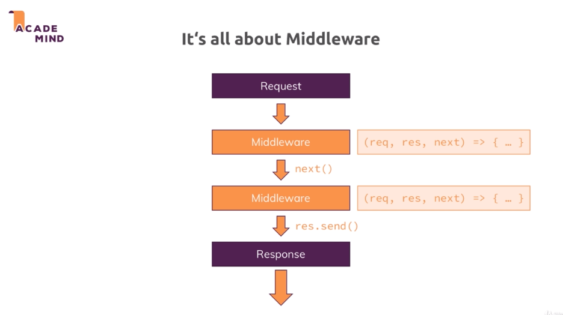
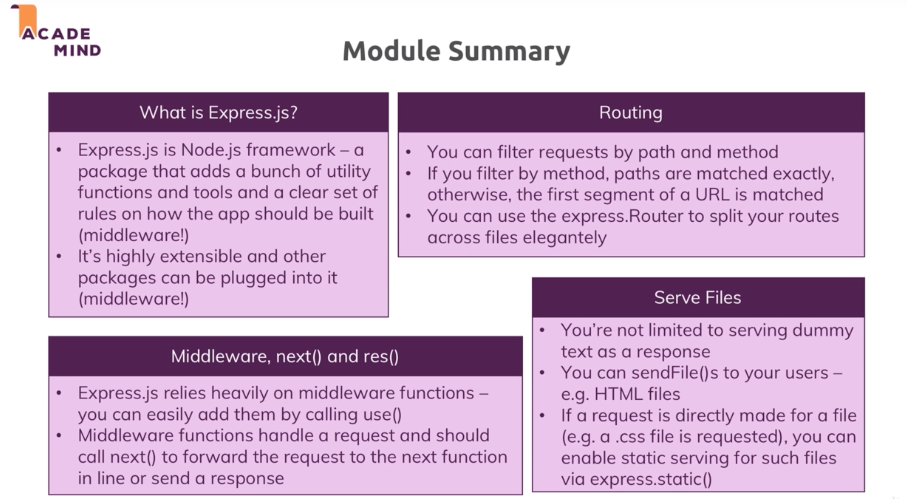
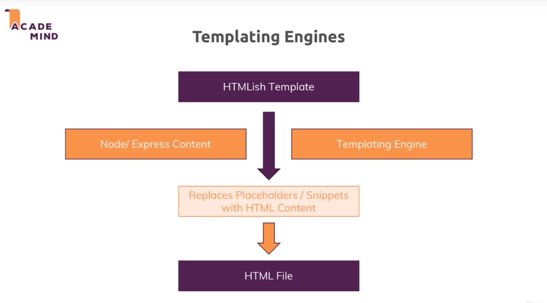

# Nodejs

## Basics

### The node lifecycle & event loop


```js
const http = require('http');

const server = http.createServer((req, res) =>{
    console.log(req)
    res.setHeader('Content-Type', 'text/html');
    res.write('<html>');
    res.write('<head><title>Hello World</title></head>');
    res.write('<body><h1>Hello World</h1></body>');
    res.write('</html>');
});
server.listen(5000);
```

More about http headers = https://developer.mozilla.org/en-US/docs/Web/HTTP/Headers


### Nodejs behind the scene


## Debugging

## Express.js
 
### Middleware


```js
npm install express --save
```
nb: --save because we want it in production
```js
const express = require('express');

const app = express();

app.use((req, res, next)=>{
    console.log('In the middleware');
    res.send('<h1>Hello from Express</h1>');
    next();
})

app.listen();
```

next() is used to say that the server request has to go to the next middleware, otherwise, the next middleware won't be called


### Handling routes

```js
// will be called if the url is /about. Be aware to not use next so the '/' isn't called
app.use('/about', (req, res, next) =>{

});

// will be called if the url begins with /
app.use('/', (req, res, next) =>{

});
```

### Parsing incoming request

Use the body-parser library
```js
npm install --save body-parser
```
To parse incoming request, we need to use the body-parser middleware
```js
 const express = require('express');
 const bodyParser = require('body-parser');

// body parser middleware
 app.use(bodyParser.urlencoded({extended: false});


 app.use('/add-product', (req, res, next) =>{
     res.send('<form><input type="text" name="product" /><button>Add product</button></form>');
 });

 app.use('/product', (req, res, next) =>{
     // req.body comes from add-product
     console.log(req.body);
     res.redirect('/');
 })

 app.use('/', (req, res, next) =>{
     res.send('<h1>Homepage</h1>')
 })
 ```

### Limiting middleware execution to POST, GET, ...
In the next exemple, if you try to access the page without the post, you will end up to the next middleware that meets the route requirement
```js
app.post('/product', (req, res, next) =>{
     // req.body comes from add-product
     console.log(req.body);
     res.redirect('/');
})
 ```


### Express router
Be aware that if we use .get, the route is limited to the exact path
***shop.js***
```js
const express = require('express');
const router = express.Router();

router.get('/', (req, res, next) =>{
    res.send('<h1>Homepage</h1>')
})

module.exports = router; 
```

***app.js***
```js
const express = require('express');
const bodyParser = require('body-parser');

const app = express();

const adminRoutes = require('./routes/admin');
const shopRoutes = require('./routes/shop');


// body parser middleware
app.use(bodyParser.urlencoded({extended: false}));

// Will filter the path to /admin/...
app.use('/admin', adminRoutes);
app.use(shopRoutes);

// Add a 404 page catching all the routes that don't match the definited ones
app.use((req, res, next) =>{
    res.status(404).send('<h1>Page not found</h1>');
    
})

app.listen(5000);
```
### Serving html files

```js
const path = require('path');
router.get('/', (req, res, next) =>{
    res.sendFile(path.join(__dirname, '../', 'views', 'shop.html'))
})
```

### Using a helper function for nav
***utils/path.js***
```js
const path = require('path');
// process.mainModule.filename means the app.js (mainModule means the module that started the app)
module.exports = path.dirname(process.mainModule.filename);
```
Then import it into the js files

```js
const path = require('path');

const express = require('express');
const router = express.Router();
const rootDir = require('../utils/path');


router.get('/', (req, res, next) =>{
    res.sendFile(path.join(rootDir, 'views', 'shop.html'))
})

module.exports = router;  
```

### Serving static files

```html
<link rel="stylesheet" href="/css/main.css">
```
```js
app.use(express.static(path.join(__dirname, 'public')));
```

#### Module summary




## Dynamic content & Templating engine

```js
const path = require('path');
const express = require('express');

const router = express.Router();

const rootDir = require('../utils/path');

const products = [];


router.get('/add-product', (req, res, next) =>{
    res.sendFile(path.join(rootDir, 'views', 'add-product.html'));
});

router.post('/add-product', (req, res, next) =>{
    // req.body comes from add-product
    products.push({ title: req.body.title });
    console.log(req.body);

    res.redirect('/');
})

exports.routes = router; //Don't forget to update the import inside the app.js to be app.use('/admin', adminData.routes);
exports.products = products; 
```



Exemple of templating engines
- EJS
- Pug
- Handlebars
***app.js***
```js
app.set('view engine', 'pug');
app.set('views', 'views');
```

and into the js files 
```js
router.get('/', (req, res, next) =>{
    const products = adminData.products;
    //res.sendFile(path.join(rootDir, 'views', 'shop.html'))
    res.render('shop', {prods: products, docTitle: 'Shop'}); 
})
```


## Module View Controller


***controllers/product.js***
```js
const products = [];

exports.getAddProduct = (req, res, next) => {
    res.render('add-product', {
        pageTitle: 'Add Product',
        path: '/admin/add-product',
        formsCSS: true,
        productCSS: true,
        activeAddProduct: true
    });
};


exports.postAddProduct = (req, res, next) => {
    products.push({ title: req.body.title });
    res.redirect('/');
};
```

***routes/admin.js***
```js
const express = require('express');
const router = express.Router();


const productsController = require('../controllers/product');

// /admin/add-product => GET
router.get('/add-product', productsController.getAddProduct);

// /admin/add-product => POST
router.post('/add-product', productsController.postAddProduct);

module.exports = router;

```