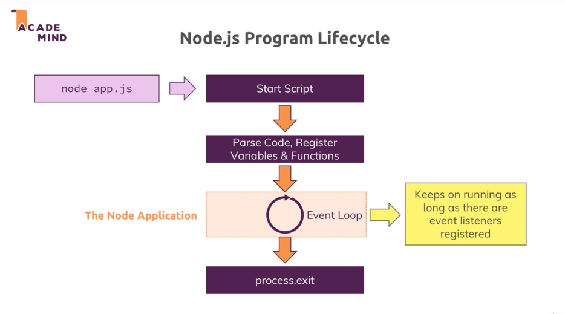
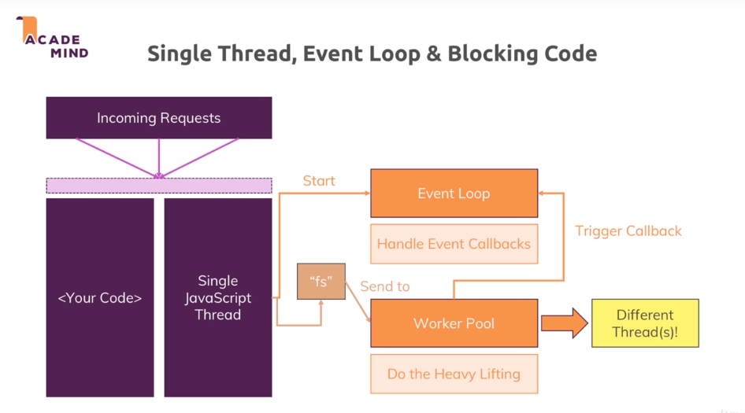
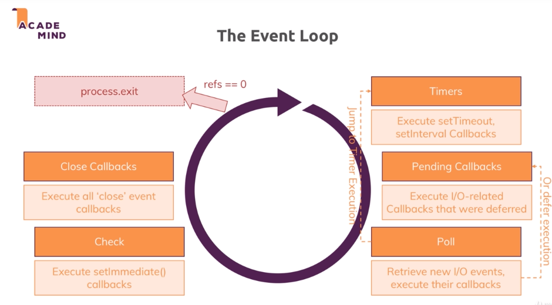

# Nodejs

## Basics

### The node lifecycle & event loop



```js
const http = require('http');

const server = http.createServer((req, res) =>{
    console.log(req)
    res.setHeader('Content-Type', 'text/html');
    res.write('<html>');
    res.write('<head><title>Hello World</title></head>');
    res.write('<body><h1>Hello World</h1></body>');
    res.write('</html>');
});
server.listen(5000);
```

More about http headers = https://developer.mozilla.org/en-US/docs/Web/HTTP/Headers


### Nodejs behind the scene


